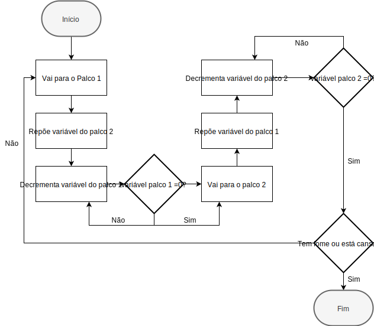

# 1º Projeto de Inteligência Artificial

###### Projeto realizado por:
Joana Marques a21701929 

Pedro Santos a21702907

##### Link do repositório GitHub : https://github.com/pedrosantosobral/AI_Projeto1

### Divisão de tarefas:
Pedro: 

- Criou a pasta de projeto inicial; 

- Alterou o script NavAgentBehavior adicionando variáveis para definir a
stamina e health e velocidade dos agentes e seus métodos para as alterar, variáveis 
de referência para os diferentes locais no mapa; 

- Fez os estados de mudança de palcos e respetivos métodos intermédios; 

- Adicionou transições entre estados em movimento; 

- Corrigiu bug da escolha de espaços verdes; 

- Fez os agentes espalharem-se pelas zonas de descanso 

- Fez a parte inicial da introdução; 

- Fez o comportamento das explosões e da fuga e morte dos agentes; 

- Adicionou o pânico entre os agentes e suas melhorias de performance; 

- Pesquisou sobre o estudo de Sagun et al; 

- Na metodologia escreveu sobre as explosões e os valores parametrizáveis; 

- Fez os cometários para documentação XML e gerou a documentação em Doxygen; 

Joana: 

- Fez o layout com o bake da navmesh; 

- Fez os limitadores das variáveis; 

- Fez os estados para comer e descansar e respetivos métodos intermédios; 

- Fez o processo de escolha dos espaços verdes; 

- Fez o estado de panico e respetivas transições; 

- Adicionou a instaciação de uma explosão num local aleatório; 

- Comentou algumas classes; 
 
- Fez a UI para contar o número de agentes mortos;
- Fez a implementação da saída extra;
- Fez a introdução e contextualização à pesquisa sobre simulação baseada em agentes; 

- Pesquisou sobre o estudo de Wagner e Agrawal e sobre o estudo de Ren et al; 

- Fez os agradecimentos; 

- Fez a parte da metodologia que fala dos estados principais e o fluxograma do 
funcionamento da mudança entre palcos; 

- Fez os resultados e discussão; 

### Introdução:
Para este projeto foi-nos proposto fazer um simulador de multidões de um festival
de música em larga escala. 

Cada agente tem de ter um comportamento próprio tentando assemelhar-se ao máximo 
a uma situação real de festival e as suas reações a certos eventos. 

Para resolver este problema usámos Finite State Machines de forma a dar diferentes 
estados aos agentes. Associados a estes estados temos transições entre eles. 

Um dos principais objetivos deste projeto é conseguir implementar as states
machines de forma a ter as reações dos agentes a certos acontecimentos.
Ao chegar ao fim do projeto, o nosso objetivo é conseguir implementar tudo aquilo
que pretendemos e obter os comportamentos mais realistas possiveis. 

Para além de fazer este simulador, foi-nos pedido também uma pesquisa sobre este
tipo de simulações. 

Para evitar acontecimentos trágicos é muito importante planear e preparar para
qualquer situação de desastre. Em situações de pânico, as pessoas têm tendência
a pensar apenas em si e nos seus interesses, querem-se salvar sem se preocupar
com os outros e isto pode levar muitas vezes a desfechos graves. Por ser tão
difícil e caro simular e reproduzir todos os cenários de perigo com pessoas reais,
são feitos estudos com agentes virtuais para imitar os eventuais comportamentos
de multidões podendo assim criar estratégias para evitar um desfecho mais grave
em situações de perigo. 

A inteligência artificial é amplamente utilizado para imitar parte do 
comportamento humano em computador, como redes neurais e
sistemas especializados (Sagun et al (2011)).
Modelação de agentes é a melhor técnica para simulação de múltiplos sistemas de
objetos porque consegue capturar dinâmicas altamente complexas que são comuns no
mundo real (Borshchev e Filippov, 2004) e então observá-las. Esta técnica é uma 
abordagem em que cada entidade do sistema que é modelado é exclusivamente 
representada como um agente independente no que respeita a tomadas de 
decisão (Fachada et al, 2015).
O comportamento global do sistema é o resultado de relacionamentos simples e
auto-organizados entre os agentes(Fachada, 2008). 

Muita densidade de pessoas e poucas saídas é uma das características comuns dos
locais de concertos e a sua combinação é um problema para a segurança das pessoas
(Wagner & Agrawal, 2014). 

Há alguns toolkits que são usados para estas implementações de simulaçoes 
baseadas em agentes que são: Swarm, Repast (Recursive Porous Agent
Simulation Toolkit), MASON (Multi-Agent Simulator of Neighborhoods) e NetLogo.
Estes toolkits têm ferramentas para fazer o design de agentes e dos ambientes em
que eles interagem. 

Já há vários estudos que envolvem modelos de agentes para simulações de multidões
e geralmente recaem em 3 categorias: 1- evacuação de multidões de edifícios,
2- evacuações de ruas, 3- comportamentos de multidões durante uma evacuação. 

**Sagun et al** 

No estudo realizado por Sagun et al (2011) são identificados problemas de projeto
de edifícios associados a emergências para melhorar a segurança durante eventos
extremos. 

O objetivo desta pesquisa é aumentar a segurança através de um design aprimorado
do ambiente construído.

Mas qual foi o papel da simulação em computadores? 

As simulações em computador podem ajudar no desenvolvimento de diretrizes de
projeto de construção que considerem os principais fatores (como número
de rotas e portas, distâncias de viagem, dimensão das rotas e portas, etc.).
Nos primeiros estudos de fluxo de multidões, foram consideradas a capacidade de
carga dos elementos do edifício, taxas de fluxo e tipos de rotas de saída,
com foco na largura e capacidade das saídas. No entanto, é necessário focar na 
compreensão das relações entre pessoas e o ambiente construído (Sagun et al 2011).

**Wagner e Agrawal** 

No modelo de Wagner e Agrawal é usada uma abordagem em que os agentes individuais 
e autónomos interagem entre si e com o ambiente. Os agentes retratam pessoas que 
são colocadas ao pé dos palcos, caminhos e outros lugares e que se tentam mover 
rapidamente para uma saída enquanto evitam um ou mais fogos. 

O modelo tem 3 componentes mais importantes: o ambiente, as dinâmicas do fogo e 
o movimento das pessoas. 

O ambiente, como já foi dito anteriormente é bastante customizável, podendo
decidir onde são os palcos, saídas e entradas e ainda os lugares sentados de
um auditório de concertos. 

A cada fogo pode ser especificado o seu raio de propagação e produção de fumo.
Os agentes podem-se aleijar ficando queimados com o fogo ou por inalação de fumo. 
Estes dados são então guardados. 

Em relação ao movimento dos agentes, este têm apenas um objetivo, sair do recinto 
sem passar pelo fogo. Assim, estes movimentos consistem em 3 componentes: seleção 
da saída, mover-se do seu lugar para um caminho e mover-se pelo caminho até à saída 
mais próxima. 

Para o estudo efetuado por Wagner e Agrawal, foram realizadas duas experiências,
uma para um auditório e outro para um estádio.
O porpósito desde sistema é para permitir a criação de multiplos cenários para
testes e avaliação de medidas de segurança para minimizar os riscos no caso
de um incêndio. 

**Ren et al** 

O modelo de Ren et al. (2009) usa agentes para simular uma evacuação na ocorrência
de uma explosão. Consideraram 5 hipóteses ou factos que são considerados para um
incêndio:
* Em situações de uma evacuação de emergência, as pessoas estão em pânico e
nervosas por isso tendem a ter comportamentos irracionais.
* As pessoas tentam mover-se o mais rápido que conseguem o que é muito mais
rápido que o normal.
* O fumo provoca uma dificuldade em respirar e dores nos olhos. Quando o fogo fica
mais denso é então muito dificil ou mesmo impossóvel ver por onde se anda.
* Começam-se a empurrar e são empurradas pelos outros.
* As pessoas que vão a correr para as saídas começam a tropeçar nas pessoas que já
cairam e por isso a multidão abranda.
Neste modelo é tido em conta diversos tipos de pessoas (homens, mulheres, crianças,
seguranças e pessoas responsáveis pelas evacuações) e também são tidas em conta
vários atributos dos agentes (idade, velocidade, escala de pânico, etc) o que não 
é visto nos modelos de simulação mais tradicionais.

### Metodologia:
A simulação foi implementada em 2.5D e os agentes têm movimento dinâmico fazendo
uso de navmesh para os seus movimentos no recinto. 

Para definir e criar os seus diferentes estados usámos Finite State Machines que 
é das técnicas mais usadas em IA para jogos e que nos permite criar estados para 
os agentes. Após a criação destes estados, a cada agente atribuiu-se um estado 
atual e este vai-se ligar aos restantes estados por transições também criadas 
por nós. Criámos inicialmente criámos os estados: ver palcos, ir para os palcos, 
ter fome, ir comer, estar cansado e ir descansar. 

Os agentes começam a simulação com valores aleatórios de fome (health), cansaço
(stamina) e preferência entre palcos. Desta maneira cada agente vai ter
comportamentos variados logo no início da simulação. 

Como num concerto normal,
os agentes quando entram no recinto dirigem-se maioritariamente para os palcos.
Ao longo do tempo vão trocando de palcos se a sua health ou stamina não forem 0. 

O fluxograma mostra o funcionamento da mudança entre palcos. 

 

Enquanto os agentes estão a ver os palcos, a sua health e stamina está a baixar 
e eventualmente quando estas chegam a 0, o estado do agente muda para ir descansar 
ou comer. 

Quando a health de um agente chega a 0, ele muda o seu estado para ir comer.
Dirige-se à zona da comida e procura uma mesa livre (temos uma lista de mesas e o
agente está sempre a procurar uma mesa livre para depois se dirigir para lá).
Passa algum tempo a comer, incrementando a sua health com o passar do tempo e ao 
mesmo tempo, a sua stamina continua a baixar. 

O mesmo acontece com a sua stamina. Se esta chegar a 0, o agente muda o seu
estado e move-se para uma zona verde para descansar onde a stamina começa a aumentar 
e a sua health a baixar. Nesta zona de espaços verdes, os agentes movem-se para um 
sitio aleatório do espaço. 

Eventualmente, quando a sua health e stamina são diferentes de 0, os agentes voltam 
a dirigir-se para um dos palcos.

Durante a execução destas ações todas podemos criar uma explosão (barra de espaços
do teclado para ativar uma explosão) que deixa os agentes em pânico. Para implementar
isto criámos mais um estado que é o de pânico e as suas respetivas transições para que
qualquer que seja o estado atual de cada agente, quando ele vê a explosão, tenha uma
transição para o estado de pânico. 

As explosões têm 3 raios, um em que os agentes morrem, outro em que agentes ficam
stunned e depois começam a mover-se a velocidade mais baixa e outro raio em que o 
pânico se propaga. Neste último raio os agentes vão começar a dirigir-se para as 
saídas e ao passar por agentes que não estavam em pânico, faz com que estes passem
a ficar em pânico também.

Para todas estas implementações que fizémos criámos valores que podem ser alterados,
ou seja, sao parametrizáveis e estes são:
- Quantidade de agentes; 

- Tempo entre spawn de agentes; 

- Número de saídas; 

- Tamanho da explosão; 

- Raio de stun em relação à explosão; 

- Velocidade de propagação do fogo; 

- Velocidade de propagação de pânico; 

- Alcance (tamanho) do pânico que os agentes espalham; 

- Tempo em que ficam stunned. 

### Resultados e discussão:
Ao realizar esta simulação reparámos que para poder ter um número bastante
elevado de agentes a correr sem haver "lag" é preciso ter computadores que tenham uma 
boa performance e otimizar bastante a implementação, porque caso contrário, há uma boa 
possibilidade de o programa começar a funcionar muito lentamente, e desta forma não 
criar os comportamentos que são pretendidos. 

Conseguimos programar comportamentos bastante similares aos de humanos reais. Como 
acontece nos festivais, o principal são os palcos e é onde as pessoas passam mais 
tempo e eventualmente depois vão comer e descansar para as zonas com relva durante 
os concertos. Obersvámos que eles ao início quando chegam aos palcos ficavam sempre 
a tentar "entrar dentro deles" porque queriam chegar ao meio do "collider" e para 
corrigir isso fomos diminuindo a sua velocidade até ela chegar a zero. 

Relativamente às explosões também conseguimos comportamentos realistas em que o pânico 
se propaga quando alguém em pânico entra em contacto com outros agentes, propagando-se 
assim entre a multidão. Quando o fogo se começa a propagar os agentes fogem para a 
saída mais próxima de si. O único comportamento que ficou àquem na implementação 
foi que independentemente de o fogo estar a obstruir uma das saídas, os agentes 
movem-se sempre para a saída mais próxima e neste caso, morrem queimados. 

Experimentámos parâmetros diferentes para algumas variáveis, como o número de saídas 
e verificámos que com apenas uma saída há muitas mais mortes de agentes do que com duas, 
porque neste último caso, há mais probabilidades dos agentes conseguirem sair em segurança. 
Experimentámos também com um alto e baixo número de agentes e verificámos que também 
isto influência a fuga do recinto em situações de perigo, pois com um amontoado de 
agentes é mais difícil de sair pela porta devido aos empurrões, no entanto torna a 
simulação muito mais realista, pois em situações de pânico as pessoas "atropelam-se" 
umas às outras. Também a velocidade de propagação do fogo influência bastante o 
número de mortes de agentes, pois quanto mais rápido se propagar, menos tempo os 
agentes têm para fugir.

### Conclusões:

### Agradecimentos:
Queremos agradecer ao professor Nuno Fachada por nos ter disponibilizado a biblioteca 
com o código das Finite State Machines e pela ajuda dada na resolução de alguns 
problemas que tivemos durante a implementação. 

Queremos agradecer também ao nosso colega Rui Martins que nos ajudou a implementar 
a dispersão dos agentes nas zonas de descanso e nos disponibilizou um método de 
extensão da classe Bounds. 

### Referências:
* Usámos a biblioteca de FSMs criada pelo professor Nuno Fachada
* Usámos um método de extensão da classe Bounds disponibilizado por Rui Martins
* Wagner, N. e Agrawal, V. (2014). An agent-based simulation system for concert
venue crowd evacuation modeling in the presence of a fire disaster.
* Ren C., Yang C., Jin S. (2009) Agent-Based Modeling and Simulation on
Emergency Evacuation. In: Zhou J. (eds) Complex Sciences. Complex 2009.
Lecture Notes of the Institute for Computer Sciences, Social Informatics and
Telecommunications Engineering, vol 5. Springer, Berlin, Heidelberg
https://doi.org/10.1007/978-3-642-02469-6_25
* Fachada N, Lopes VV, Martins RC, Rosa AC. 2015. Towards a standard model
for research in agent-based modeling and simulation. PeerJ Computer Science
1:e36 https://doi.org/10.7717/peerj-cs.36
* Sagun A., Bouchlaghem D., Anumba C. (2011) Computer simulations vs. building 
guidance to enhance evacuation performance of buildings during emergency events. 
https://doi.org/10.1016/j.simpat.2010.12.001
